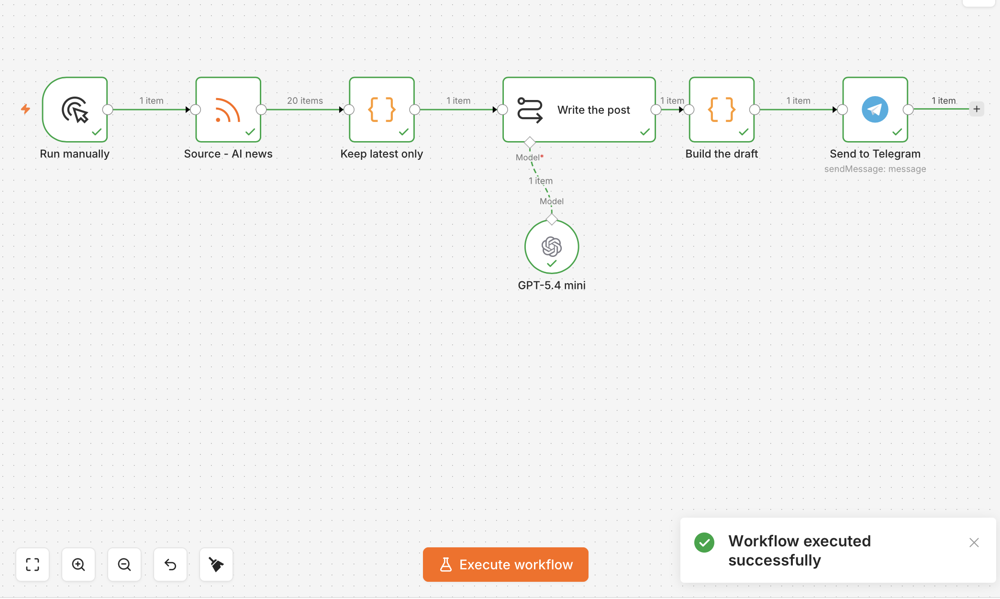

# Content Engine

An n8n workflow that reads a news source, writes a social media post in the client's voice, and delivers it as a **draft for human review** — not an auto-publisher.

Built with n8n + OpenAI. Runs locally, costs cents per post.



## What it does

```
Manual trigger → RSS feed → Keep latest item → LLM chain → Build draft → Telegram
```

1. Pulls the latest articles from an RSS feed (currently TechCrunch AI).
2. Keeps only the most recent one.
3. An LLM turns it into a social post that follows a strict voice brief: no hype vocabulary, hard hook, 120-word cap, closing question, mixed-language hashtags.
4. Wraps the post together with its source headline and link.
5. Sends it to Telegram, ready to approve or discard.

## Why a draft and not auto-publishing

Fully automated posting is easy to build and a bad idea for any account that represents a real brand. A generated post that misreads its source is indistinguishable from a good one until someone reads it — so a human stays in the loop, and the source link travels with the draft to make that check take five seconds.

It is also easier to sell: clients who care about their brand want approval, not autonomy.

## Design notes

- **The model is a sub-node, not the pipeline.** Swapping OpenAI for Gemini, Claude or a local model means replacing one node; nothing else in the workflow changes. Provider lock-in is a choice, not a requirement.
- **Fan-out is capped before the expensive node.** The feed returns ~20 items; a Code node trims to 1 before the LLM runs. Without it, one click means 20 API calls.
- **The prompt is a tuned parameter, not a wish.** The first iteration produced a soft hook and English-only hashtags on a Spanish post. Two explicit constraints fixed both.
- **The prompt is written in Spanish on purpose.** The workflow is in English, but the voice brief is written in the language of the audience it writes for — a post for a Latin American audience is drafted in Spanish, including the register (*voseo*). Point the brief at another market and the language follows.

## Stack

| Piece | Choice |
|---|---|
| Orchestration | n8n 2.31.6 (self-hosted, local) |
| Model | OpenAI `gpt-5.4-mini` |
| Source | RSS |
| Delivery | Telegram Bot API |
| Runtime | Node 22 LTS |

## Running it

```bash
npm install -g n8n
N8N_DIAGNOSTICS_ENABLED=false n8n start   # http://localhost:5678
```

Import `workflow/content-engine.workflow.json`, then set:

- **OpenAI credential** — an API key restricted to `List models: Read` + `Chat completions: Request`.
- **Telegram credential** — a bot token from [@BotFather](https://t.me/botfather). Send `/start` to your own bot first; Telegram blocks bots from opening a conversation.
- **`YOUR_TELEGRAM_CHAT_ID`** in the Telegram node — your numeric id, from [@userinfobot](https://t.me/userinfobot).

No credentials are stored in this repository. n8n keeps them encrypted in `~/.n8n`.

## Status

Working end to end. Manual trigger by design while the voice is being tuned — a schedule trigger is a one-node change.

Roadmap: deduplicate seen articles, source selection beyond a single feed, and an Instagram delivery path (Meta Graph API requires a Business/Creator account linked to a Facebook page).

---

Built by [Charles Rick](https://rickquant.github.io) — AI agents and automations.
